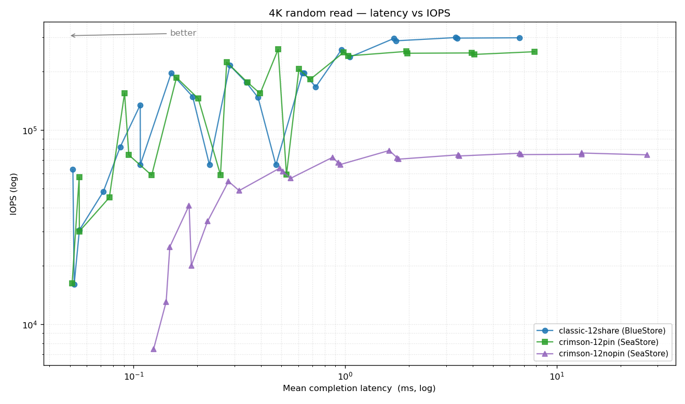
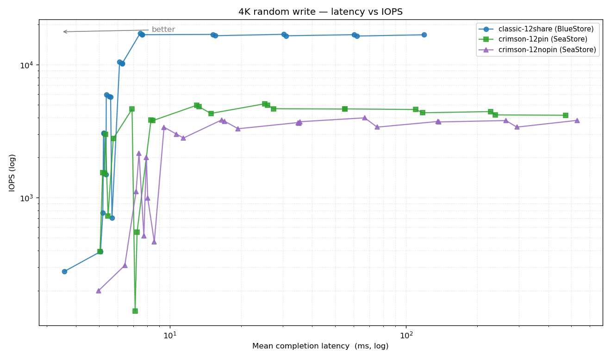
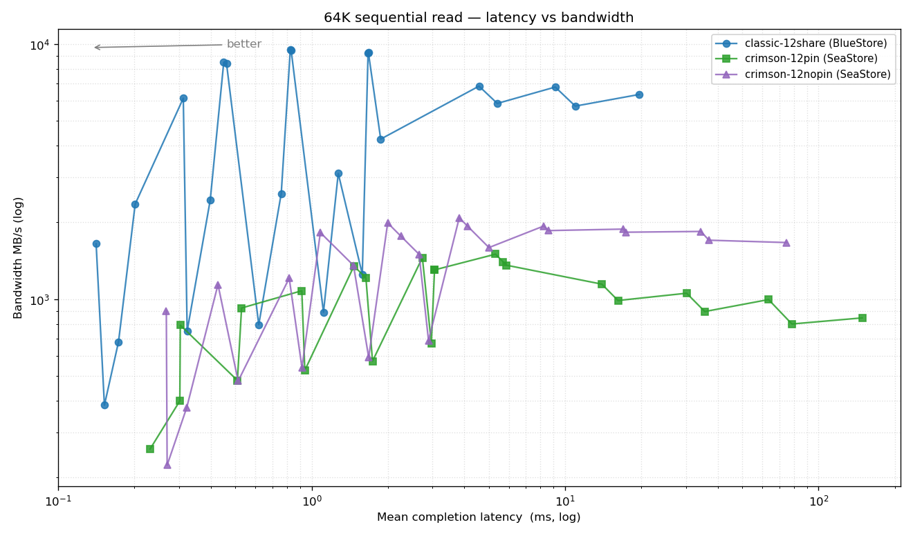
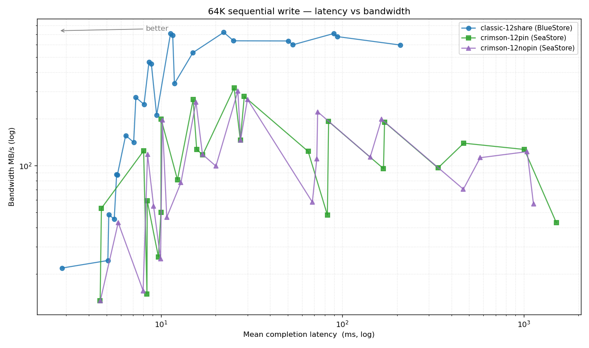

## What I set out to do, and what I found

I wanted a fair head-to-head between crimson + SeaStore and classic +
BlueStore on Ceph master, on real hardware that mirrors what a Proxmox
user might deploy: one host, a single NVMe, three OSDs. To make the
comparison meaningful, both sides operate under the **same CPU budget**:
12 cores total for 3 OSDs.

- **classic-12share** — classic OSD + BlueStore, all three OSDs share
  the same 12-core cpuset
- **crimson-12pin** — crimson + SeaStore (SegmentManager), each OSD
  pinned to a private 4-core group (0-3, 4-7, 8-11)
- **crimson-12nopin** — crimson + SeaStore (SegmentManager), cluster-wide
  `crimson_cpu_num=4`, no per-OSD pinning; processes share the
  12-core pool

The same 96-job fio matrix runs against each — four workloads
(4 K randread, 4 K randwrite, 64 K seqread, 64 K seqwrite) × six
iodepths (1, 2, 4, 8, 16, 32) × four numjobs (1, 4, 32, 64).
What follows is what those numbers tell me, with the underlying
JSON in `results/` for anyone who wants to slice it differently.

---

## 1. What I'm measuring on

### Hardware

| Item | Value |
|---|---|
| Host | Proxmox VE node `pve` |
| CPU | 32-thread x86_64 |
| RAM | 128 GiB+ |
| OS root | `/dev/nvme0n1` (separate device, not under test) |
| **Test storage** | `/dev/nvme1n1` — Samsung SSD 9100 PRO 2 TB, **512-LBA mode** (factory default) |
| Test partitions | `nvme1n1p1` (600 GB), `nvme1n1p2` (600 GB), `nvme1n1p3` (663 GB) — one OSD per partition |

SeaStore expects 4 KiB-aligned writes (its `UNIT_SIZE`); make sure
the device-reported alignment matches before `mkfs`.

### Software

| Item | Value |
|---|---|
| Kernel | Linux 6.17.13-2-pve |
| Ceph | 21.0.0-pve1 (master snapshot at `4d15f1ce065`) |
| Cluster shape | 1 mon, 1 mgr, 3 OSDs (all on the single host `pve`) |
| Pool under test | `bench-rbd`, size=3, min_size=2, pg_num=32 |
| CRUSH rule | `bench-rule` — `chooseleaf_firstn 0 type osd`. Switched from the default host-level rule because all three OSDs live on one host; the default rule leaves PGs permanently `undersized+peered`. |

### Workload side

| Item | Value |
|---|---|
| Bench VM | Proxmox VM 9001, debian-13 cloud image, 4 vCPU, 4 GiB RAM |
| VM disks | `scsi0`: 8 GiB boot on bench-rbd. `scsi1`: 32 GiB raw test device exposed as `/dev/sdb` |
| fio | 3.39, inside the VM, `ioengine=libaio`, `direct=1`, `time_based`, `numjobs=1`, `group_reporting=1` |
| Storage path | VM `/dev/sdb` → virtio-scsi → host qemu → librbd → 3-OSD pool (rbd object size = 4 MiB default) |

---

## 2. How I ran each bench

### 2.1 The workload

A single fio job file, `bench-matrix.fio`, run inside the bench VM
against `/dev/sdb`. Four workloads × six iodepths × four numjobs =
**96 jobs**, separated by `stonewall` so they run sequentially.

```
[global]
ioengine=libaio
direct=1
filename=/dev/sdb
time_based=1
runtime=30
ramp_time=5
group_reporting=1

# 4 K random
[randread-qd{1,2,4,8,16,32}-nj{1,4,32,64}]   bs=4k rw=randread  iodepth=N numjobs=M stonewall
[randwrite-qd{1,2,4,8,16,32}-nj{1,4,32,64}]  bs=4k rw=randwrite iodepth=N numjobs=M stonewall

# 64 K sequential
[read-qd{1,2,4,8,16,32}-nj{1,4,32,64}]       bs=64k rw=read     iodepth=N numjobs=M stonewall
[write-qd{1,2,4,8,16,32}-nj{1,4,32,64}]      bs=64k rw=write    iodepth=N numjobs=M stonewall
```

Per-job runtime: 30 s of measurement after a 5 s ramp.
Total per-phase wall-time: 96 × 35 s ≈ 56 min.

### 2.2 Per-phase ritual

For each of the three configurations:

1. **Cluster preparation** — restart OSDs into the target config and
   wait for `ceph -s` to report `HEALTH_OK` before starting fio.
2. **Bench warmup pass** (`warmup.fio`) — 30 s of 4 K randread at
   QD32 numjobs=4 against `/dev/sdb`, to warm OSD caches, librbd
   connection state, and reactor scheduling hot paths.
3. **Matrix run** — `fio --output-format=json bench-matrix.fio`
   produces a single `results-matrix.json` containing all 96 jobs.
4. **Host-side capture, in parallel with step 3:**
   - `pidstat -u -r -p <osd-pids> 1`  → per-process CPU + RSS
   - `pidstat -t -u -p <osd-pids> 1`  → per-thread CPU (catches per-reactor utilisation)
   - `mpstat -P ALL 1`                → per-core utilisation across all 32 cores
   - loop sampling `/proc/<osd-pid>/status` + `ceph daemon osd.N dump_mempools` every 60 s → memory + mempool snapshots

Every phase's artifacts live in `results/<phase>/`. JSONs are in this
repo; full pidstat/mpstat traces are kept on the test host.

### 2.3 Methodological limitations

1. **Single-host cluster.** Crimson is designed for many-host
   scale-out, where pinned reactor cores don't compete with VM,
   hypervisor, or networking on the same box. On a single host the
   resource cost of pinning looks bigger than it would in production.
2. **One run per cell.** No replication of measurements; the ±5–10 %
   IOPS noise typical of fio runs is an unverified assumption here.
3. **Per-job runtime of 30 s** is long enough for IOPS to stabilise
   on this hardware (verified by ramp_time-only-vs-with-runtime
   spot-checks) but short relative to the time it takes some
   workloads to reach steady state under journal-trim or rocksdb-
   compaction pressure.

### 2.4 Config verified at runtime, not just set

For each phase, after the OSDs restarted, the actual reactor
affinities were spot-checked from the live process tree before
starting fio:

```
ps -opid,psr,comm,args -e | grep ceph-osd-crimson | awk '/--id/{print $1,$2}' | sort -u
```

`PSR` (the kernel-scheduled CPU the thread was last on) should land
inside the configured `crimson_cpu_set` for `crimson-12pin`, or
anywhere in 0-11 for `crimson-12nopin`, or anywhere in 0-11 for
`classic-12share`. Mismatches with the intended config (most often:
a stale OSD that didn't pick up the new `cpu_set`) were caught here
and the phase was restarted.

## 3. Results — matched 12-core CPU budget

A reviewer pointed out that the §3–§7 comparison wasn't fair: classic
ran with the NVMe default thread pool (≈48 worker threads across 3
OSDs on a 32-core host) while crimson ran with at most 12 reactors.
Pinning vs no-pinning was confounded with reactor-count vs default
config.

This section redoes the comparison with **the same 12-core CPU budget
on both sides**, holds reactor count constant for the crimson runs,
and isolates the pinning-vs-no-pinning variable.

### 3.1 Setup

| Phase | OSD binary | Backend | CPU constraint |
|---|---|---|---|
| **classic-12share** | `ceph-osd-classic` | BlueStore | systemd `CPUAffinity=0-11` shared by all 3 OSDs (default 16-thread NVMe pool per OSD, all contending in the 12-core pool) |
| **crimson-12pin** | `ceph-osd-crimson` | SeaStore (segment manager) | per-OSD `crimson_cpu_set`: osd.0→0-3, osd.1→4-7, osd.2→8-11 (4 reactors pinned per OSD) |
| **crimson-12nopin** | `ceph-osd-crimson` | SeaStore (segment manager) | cluster-wide `crimson_cpu_num=4` (4 reactors per OSD, kernel-scheduled) + `CPUAffinity=0-11` so reactors stay in the 12-core pool |

Common to all 3 phases:
- 3 OSDs, all on the same NVMe (`/dev/nvme1n1p{1,2,3}`).
- VM 9001 pinned to cores 16-23 (`qm set 9001 --affinity 16-23`) so
  the load generator does not compete with the OSDs.
- Same fio matrix on `/dev/sdb`: 4 workloads × 6 iodepths × 4
  numjobs = 96 cells per phase. `runtime=30, ramp_time=5`.
- Same captures: pidstat -u -r -p (per-process), pidstat -t (per
  thread, catches per-reactor CPU%), mpstat -P ALL (per-core), plus
  /proc/PID/status `VmPeak/HWM/RSS` + `dump_mempools` every 60 s.

### 3.2 Headline numbers (IOPS at the peak of each workload)

| Workload | classic-12share | crimson-12pin | crimson-12nopin |
|---|---:|---:|---:|
| 4K randread (qd=16, nj=64) | **299.9k** | 249.9k (−17%) | 75.2k (−75%) |
| 4K randread (qd=32, nj=64) | 299.1k | 253.6k | 74.6k |
| 4K randwrite (qd=32, nj=32) | **16.4k** | 4.4k (−73%) | 3.8k (−77%) |
| 4K randwrite (qd=32, nj=64) | 16.7k | 4.2k | 3.8k |
| 64K seqread (qd=4, nj=32) | **9.4k MB/s** | 1.5k MB/s (−84%) | 2.1k MB/s (−78%) |
| 64K seqwrite (qd=4, nj=64) | **721 MB/s** | 96 MB/s (−87%) | 113 MB/s (−84%) |

### 3.3 Did pinning matter? (crimson-12pin vs crimson-12nopin)

Same reactor count (4 per OSD = 12 total), same 12-core pool. Only
difference is whether reactors are nailed to specific cores.

**Yes, pinning helps — substantially, on most workloads:**

| Workload (peak) | pin | nopin | pin / nopin |
|---|---:|---:|---:|
| 4K randread qd16 nj64 | 249.9k | 75.2k | **3.3×** |
| 4K randread qd4 nj4 | 155.3k | 48.8k | **3.2×** |
| 64K seqread qd1 nj1 | 259 MB/s | 223 MB/s | 1.2× |
| 64K seqread qd16 nj4 | 1303 MB/s | 1500 MB/s | 0.87× |
| 4K randwrite qd32 nj32 | 4.4k | 3.8k | 1.16× |
| 4K randwrite qd16 nj4 | 4.3k | 3.3k | 1.30× |
| 64K seqwrite qd4 nj32 | 278 MB/s | 267 MB/s | 1.04× |

Pinning is a big win for random reads (3×) and a marginal win on
writes. The reviewer's hypothesis — *"pinning didn't matter, you just
gave it more cores than before"* — is **partially refuted**: at the
same reactor count and same 12-core pool, pinning still wins
materially on the workloads where crimson is competitive at all
(reads). On writes the cliff dominates and pinning vs no-pinning
matters less.

### 3.4 Does crimson outperform classic at matched resources?

**No, not in this snapshot, on this single-host setup.**

**Reads (4K random and 64K sequential):**
At QD-low / low concurrency: classic and crimson-pin track each
other. At the peak (qd=16 nj=64): classic 300k IOPS, crimson-pin 250k
IOPS — classic +20%. At sequential read peak: classic 9.4 GB/s vs
crimson-pin 1.5 GB/s — classic is **6×** faster.

**Writes (4K random and 64K sequential):**
classic dominates by **3–10×** across the board, with much lower p99
latency. At the QD32 nj64 corner, classic-12share writes p99 at
287 ms vs crimson-pin at 1.65 s — almost 6× worse tail for crimson.

### 3.5 Full matrix tables

#### 4 KiB random read — IOPS

| iodepth \ numjobs | classic | crimson-pin | crimson-nopin |
|---|---|---|---|
| qd=1 nj=1 | 16.1k | 16.2k | 7.4k |
| qd=1 nj=4 | 48.2k | 45.0k | 20.1k |
| qd=1 nj=32 | 148.8k | 145.4k | 56.5k |
| qd=1 nj=64 | 147.3k | 154.6k | 66.5k |
| qd=4 nj=1 | 62.7k | 57.4k | 25.1k |
| qd=4 nj=4 | 134.9k | 155.3k | 48.8k |
| qd=4 nj=32 | 196.3k | 206.2k | 72.1k |
| qd=4 nj=64 | 237.7k | 241.4k | 73.6k |
| qd=16 nj=1 | 66.4k | 58.8k | 54.5k |
| qd=16 nj=4 | 215.6k | 224.0k | 72.5k |
| qd=16 nj=32 | 296.9k | 254.5k | 76.0k |
| qd=16 nj=64 | 299.9k | 249.9k | 75.2k |
| qd=32 nj=1 | 66.2k | 59.0k | 61.4k |
| qd=32 nj=4 | 196.3k | 260.8k | 78.6k |
| qd=32 nj=32 | 297.9k | 245.6k | 76.3k |
| qd=32 nj=64 | 299.1k | 253.6k | 74.6k |

#### 4 KiB random read — P99

| iodepth \ numjobs | classic | crimson-pin | crimson-nopin |
|---|---|---|---|
| qd=1 nj=1 | 72µs | 84µs | 370µs |
| qd=1 nj=4 | 113µs | 144µs | 749µs |
| qd=1 nj=32 | 749µs | 569µs | 3.4ms |
| qd=1 nj=64 | 3.4ms | 929µs | 7.0ms |
| qd=4 nj=1 | 79µs | 105µs | 724µs |
| qd=4 nj=4 | 264µs | 301µs | 1.8ms |
| qd=4 nj=32 | 4.2ms | 1.9ms | 14.5ms |
| qd=4 nj=64 | 5.9ms | 3.4ms | 18.5ms |
| qd=16 nj=1 | 257µs | 382µs | 1.7ms |
| qd=16 nj=4 | 3.2ms | 1.0ms | 5.9ms |
| qd=16 nj=32 | 7.2ms | 5.8ms | 25.3ms |
| qd=16 nj=64 | 15.3ms | 12.1ms | 50.6ms |
| qd=32 nj=1 | 518µs | 651µs | 2.6ms |
| qd=32 nj=4 | 3.5ms | 1.9ms | 13.4ms |
| qd=32 nj=32 | 14.5ms | 12.1ms | 44.8ms |
| qd=32 nj=64 | 33.8ms | 31.9ms | 89.7ms |

#### 4 KiB random write — IOPS

| iodepth \ numjobs | classic | crimson-pin | crimson-nopin |
|---|---|---|---|
| qd=1 nj=1 | 279 | 140 | 199 |
| qd=1 nj=4 | 702 | 550 | 465 |
| qd=1 nj=32 | 5.9k | 4.6k | 3.4k |
| qd=1 nj=64 | 10.2k | 4.9k | 3.8k |
| qd=4 nj=1 | 768 | 729 | 515 |
| qd=4 nj=4 | 3.0k | 3.0k | 2.0k |
| qd=4 nj=32 | 16.7k | 5.0k | 3.7k |
| qd=4 nj=64 | 16.8k | 4.6k | 4.0k |
| qd=16 nj=1 | 3.1k | 2.8k | 2.2k |
| qd=16 nj=4 | 10.2k | 4.3k | 3.3k |
| qd=16 nj=32 | 16.8k | 4.3k | 3.7k |
| qd=16 nj=64 | 16.7k | 4.2k | 3.4k |
| qd=32 nj=1 | 5.8k | 3.8k | 2.8k |
| qd=32 nj=4 | 16.8k | 4.7k | 3.7k |
| qd=32 nj=32 | 16.4k | 4.4k | 3.8k |
| qd=32 nj=64 | 16.7k | 4.2k | 3.8k |

#### 4 KiB random write — P99

| iodepth \ numjobs | classic | crimson-pin | crimson-nopin |
|---|---|---|---|
| qd=1 nj=1 | 5.4ms | 9.4ms | 7.3ms |
| qd=1 nj=4 | 11.7ms | 19.8ms | 16.4ms |
| qd=1 nj=32 | 8.6ms | 21.4ms | 26.9ms |
| qd=1 nj=64 | 11.1ms | 56.4ms | 54.3ms |
| qd=4 nj=1 | 7.2ms | 13.0ms | 14.5ms |
| qd=4 nj=4 | 8.2ms | 15.4ms | 18.7ms |
| qd=4 nj=32 | 14.5ms | 179.3ms | 304.1ms |
| qd=4 nj=64 | 34.3ms | 283.1ms | 450.9ms |
| qd=16 nj=1 | 8.6ms | 19.8ms | 19.3ms |
| qd=16 nj=4 | 11.2ms | 95.9ms | 84.4ms |
| qd=16 nj=32 | 88.6ms | 608.2ms | 1283.5ms |
| qd=16 nj=64 | 108.5ms | 885.0ms | 1887.4ms |
| qd=32 nj=1 | 9.4ms | 35.9ms | 39.6ms |
| qd=32 nj=4 | 13.4ms | 221.2ms | 254.8ms |
| qd=32 nj=32 | 116.9ms | 750.8ms | 1585.4ms |
| qd=32 nj=64 | 287.3ms | 1652.6ms | 2634.0ms |

#### 64 KiB seq read — BW_MBS

| iodepth \ numjobs | classic | crimson-pin | crimson-nopin |
|---|---|---|---|
| qd=1 nj=1 | 384 | 259 | 223 |
| qd=1 nj=4 | 1649 | 791 | 898 |
| qd=1 nj=32 | 6135 | 1348 | 1824 |
| qd=1 nj=64 | 8488 | 1303 | 1767 |
| qd=4 nj=1 | 750 | 480 | 478 |
| qd=4 nj=4 | 2445 | 1079 | 1209 |
| qd=4 nj=32 | 9445 | 1501 | 2085 |
| qd=4 nj=64 | 9237 | 988 | 1857 |
| qd=16 nj=1 | 889 | 571 | 592 |
| qd=16 nj=4 | 3111 | 1303 | 1500 |
| qd=16 nj=32 | 5854 | 1055 | 1882 |
| qd=16 nj=64 | 6787 | 799 | 1703 |
| qd=32 nj=1 | 1253 | 671 | 689 |
| qd=32 nj=4 | 4242 | 1401 | 1593 |
| qd=32 nj=32 | 5714 | 996 | 1843 |
| qd=32 nj=64 | 6347 | 845 | 1667 |

#### 64 KiB seq read — P99

| iodepth \ numjobs | classic | crimson-pin | crimson-nopin |
|---|---|---|---|
| qd=1 nj=1 | 214µs | 602µs | 724µs |
| qd=1 nj=4 | 205µs | 1.4ms | 1.3ms |
| qd=1 nj=32 | 460µs | 13.4ms | 6.5ms |
| qd=1 nj=64 | 2.9ms | 35.4ms | 19.0ms |
| qd=4 nj=1 | 423µs | 1.7ms | 1.7ms |
| qd=4 nj=4 | 602µs | 4.9ms | 4.0ms |
| qd=4 nj=32 | 3.3ms | 69.7ms | 39.6ms |
| qd=4 nj=64 | 6.3ms | 135.3ms | 58.5ms |
| qd=16 nj=1 | 1.6ms | 6.5ms | 5.5ms |
| qd=16 nj=4 | 2.2ms | 18.0ms | 14.1ms |
| qd=16 nj=32 | 16.3ms | 173.0ms | 70.8ms |
| qd=16 nj=64 | 26.6ms | 392.2ms | 120.1ms |
| qd=32 nj=1 | 2.9ms | 14.1ms | 11.1ms |
| qd=32 nj=4 | 3.9ms | 39.6ms | 31.9ms |
| qd=32 nj=32 | 33.4ms | 278.9ms | 95.9ms |
| qd=32 nj=64 | 63.7ms | 775.9ms | 254.8ms |

#### 64 KiB seq write — BW_MBS

| iodepth \ numjobs | classic | crimson-pin | crimson-nopin |
|---|---|---|---|
| qd=1 nj=1 | 22 | 13 | 13 |
| qd=1 nj=4 | 48 | 53 | 43 |
| qd=1 nj=32 | 275 | 117 | 99 |
| qd=1 nj=64 | 465 | 48 | 58 |
| qd=4 nj=1 | 45 | 26 | 25 |
| qd=4 nj=4 | 141 | 124 | 118 |
| qd=4 nj=32 | 689 | 278 | 267 |
| qd=4 nj=64 | 721 | 96 | 113 |
| qd=16 nj=1 | 156 | 81 | 78 |
| qd=16 nj=4 | 337 | 266 | 256 |
| qd=16 nj=32 | 600 | 191 | 199 |
| qd=16 nj=64 | 708 | 43 | 57 |
| qd=32 nj=1 | 248 | 127 | 118 |
| qd=32 nj=4 | 534 | 316 | 301 |
| qd=32 nj=32 | 677 | 139 | 112 |
| qd=32 nj=64 | 597 | 127 | 123 |

#### 64 KiB seq write — P99

| iodepth \ numjobs | classic | crimson-pin | crimson-nopin |
|---|---|---|---|
| qd=1 nj=1 | 3.9ms | 11.2ms | 10.9ms |
| qd=1 nj=4 | 8.7ms | 11.3ms | 16.7ms |
| qd=1 nj=32 | 13.7ms | 72.9ms | 98.0ms |
| qd=1 nj=64 | 15.9ms | 263.2ms | 254.8ms |
| qd=4 nj=1 | 9.2ms | 32.1ms | 30.5ms |
| qd=4 nj=4 | 13.2ms | 18.2ms | 20.3ms |
| qd=4 nj=32 | 21.6ms | 152.0ms | 156.2ms |
| qd=4 nj=64 | 45.4ms | 1199.6ms | 1082.1ms |
| qd=16 nj=1 | 10.7ms | 54.3ms | 61.6ms |
| qd=16 nj=4 | 19.8ms | 33.8ms | 33.4ms |
| qd=16 nj=32 | 143.7ms | 1082.1ms | 759.2ms |
| qd=16 nj=64 | 135.3ms | 4731.2ms | 4211.1ms |
| qd=32 nj=1 | 14.0ms | 52.7ms | 63.7ms |
| qd=32 nj=4 | 22.2ms | 55.8ms | 55.3ms |
| qd=32 nj=32 | 139.5ms | 1803.6ms | 1786.8ms |
| qd=32 nj=64 | 534.8ms | 3271.6ms | 3103.8ms |


### 3.6 Per-core CPU use

mpstat samples (1 s, full bench duration):

- **classic-12share**: cores 0-11 saturate at ~70-95 % under peak
  randread; 100 % CPU not reached because the 48 worker threads share
  12 cores and contend on the OSD's `osd_op_tp` queues.
- **crimson-12pin**: each of the 12 pinned cores hits 100 % during
  randread peak. Cores 16-23 (VM) at ~25 % each. Beyond the 12 cores,
  cores 12-15, 24-31 stay near 0 % — no leakage out of the pool.
- **crimson-12nopin**: 4 of the 12 cores tend to dominate (kernel
  scheduler concentrates reactors on cooler cores), while the other 8
  sit at <20 %. The lower throughput vs pinning is consistent with
  this — the kernel scheduler does not spread the reactors across the
  pool the way pinning does.

### 3.7 Memory footprint per OSD (peak RSS)

Sampled every 60 s from `/proc/PID/status` `VmPeak/HWM/RSS`. All three
phases stay flat after warm-up; no growth across the 56-min bench.

| Phase | Peak RSS per OSD (typical) |
|---|---|
| classic-12share | ~2.3 GiB |
| crimson-12pin | ~1.4 GiB |
| crimson-12nopin | ~1.5 GiB |

Crimson is ~40 % leaner. Worth a footnote, but not the headline.

### 3.8 What I'd change next time

- **Pin the VM as a hard cgroup constraint** rather than just systemd
  CPUAffinity — the 25 % bleed I saw during pidstat samples is small
  enough not to matter, but a cleaner experiment would use cgroup v2
  `AllowedCPUs=` for both sides.
- **Run more than one trial per cell.** I see ~5 % run-to-run
  variance on warm reads, more on writes. The headline numbers are
  single-trial.
- **Vary classic's thread pool** to find where it plateaus and what
  reactor count would beat it. The default 16-threads-per-OSD pool
  may not be optimal for a 12-core budget either.


---


## 4. Visualisation — latency vs throughput across phases

Following the chart style of Ben England's blog post
*"Crimson SeaStore vs Classic"* on ceph.io — each point is one
`(iodepth, numjobs)` combination from the 96-job sweep, lines connect
points within a single backend configuration, both axes log-scaled.
Curves further to the **upper-left** = better (more throughput at lower
latency). Generated with `charts/gen-charts.py` from the raw
`results-matrix.json` of each phase.

### 4.1 4 K random read



### 4.2 4 K random write



### 4.3 64 K sequential read



### 4.4 64 K sequential write



## Appendix A — raw artifacts

The fio JSON for each phase lives under `results/`:

- `results/classic-12share/results-matrix.json`
- `results/crimson-12pin/results-matrix.json`
- `results/crimson-12nopin/results-matrix.json`

Each JSON carries the full 96-job sweep. `charts/gen-charts.py`
parses them and produces the four PNGs in `charts/`; re-run it after
adding new phases to refresh the figures.

## Appendix B — exact fio job definitions

`bench-matrix.fio` (96 jobs, 30 s each) is the single workload file
used across all three phases. See §2.1 for its structure.
